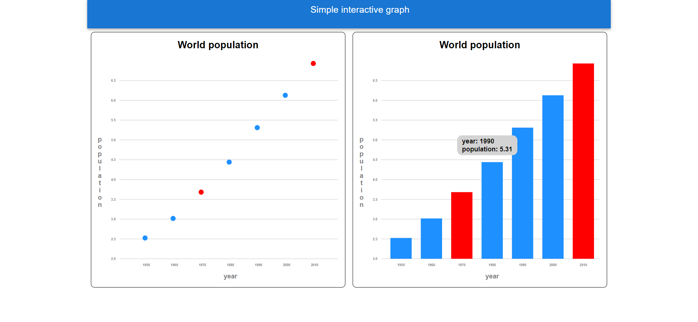

# Simple-React-Graph
A simple interactive React graph I made to help me learn React basics.
Created using WebStorm, React, d3, and MUI.
It displays two graphs of the world population over time. Clicking on a data point on a graph turns it red on both graphs, and clicking it again returns it to blue. Any number of data points can be selected at one time. Hovering over a data point displays its data in a tooltip.

